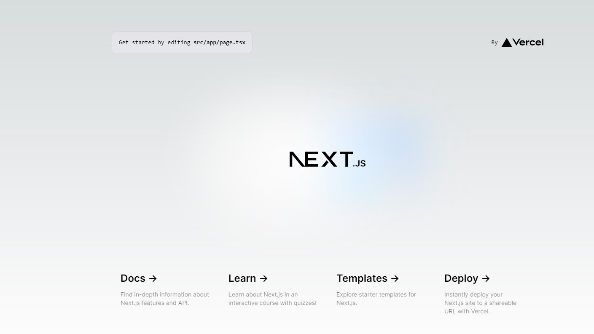

# What is Next.js?
It is a react-Framework for building web applications.

In order to understand next.js, it is important to first understand what the **React**-framework is: React is great for building UIs, but by itself, it is not enough for web development, since it does not provide essential features like server- or client-side rendering, static site generation, simplified routing, and streamlined deployment. Next.js extends React to include these missing features (The React-framework has purposely been built in a way that allows extension by other frameworks)
# Prerequisites
- Javascript
- HTML
- CSS
- Basic understanding of React
# Tooling and preparation
Install:
- Node.js
# Hello World
you can create your next-project by running
```bash
npx create-next-app@latest
```
When it asks you for a project name, type hello-world. Then it will ask you whether you would like to use TypeScript, ESLint and all kinds of different stuff. These are not important for now. Just answer yes to all of them, so we can move on.

After finishing the generation, there should be a new folder called hello-world. Enter it launch the web app by running
```bash
npm run dev
```
This will show you the web adress at which you can access your web app, probably
```bash
  - Local:        http://localhost:3000
```
Open it in your browser. If you see something similar to this

then congratulations! You sucessfully created a Next.js app.

Now let's start editing it. In the project folder, there should be the file `page.tsx` in `src/app`. Open it an edit the html-code (e.g. insert a hello-world paragraph). You can see your changes without rebuilding. Just save the file and check the browser.
# Architecture
in `src/app`, you can find a file called `layout.tsx`. This is the main page. `children` is replaced by teh code we can find in `page.tsx`. 