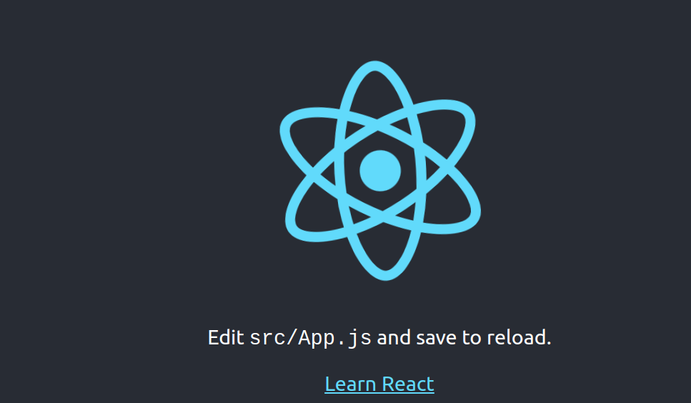

# What is React?
React is a JavaScript libaray with which we can create SPA-websites.
# Prerequisites
HTML, CSS and JavaScript
# Tooling and preparation
Node.js
# Architecture
## File structure
A react project consists of the following folders:
- node_modules: all dependencies are stored here. If you want to change them, do not tamper with this folder, but change `package.json`, then run `npm install`.
- public: contains index.html, which is the start page for our app.
- src: source folder for react code
Note: In normal projects, we will only ever touch the src-folder and ignore node_modues and public.
## Components
A react website consists of several components that are arranged in tree-form. A component consists of a template and logic.
# Hello World
you can create a react project by running 
```bash
npx create-react-app hello-react
```
This command should create a new folder called hello-react. Change to this folder and launch the website by running
```sh
npm run start
```
This should open your browser at `http://localhost:3000` and show this image:

You can now change the html-code [^1] of `src/index.js`. We could, for instance, reduce most of the code like this:
```jsx
import './App.css';
function App() {
  return (
    <div className="App">
      <div className="content">
        <h1>Hello world!</h1>
      </div>
    </div>
  );
}
export default App;
```
Save the file and look at the react-app in your browser. It should have been updated to show Hello world.

[^1]: Technically it's jsx-code, not html

# 